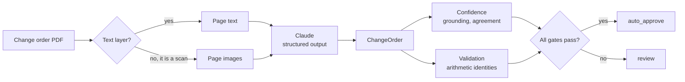

# Change Order Extraction

Reads a construction change order PDF and returns structured JSON with per-field
confidence, arithmetic validation flags, and a decision on whether a human needs
to review it.

## Architecture



Confidence asks *did we read this correctly*. Validation asks *does this document
add up*. They catch different failures, which is why both exist: a model can be
98% confident it read `4,440.00` when the page said `4,400.00`, and only the
arithmetic notices.

## Setup

```bash
uv sync                      # add --extra api for the HTTP layer
export ANTHROPIC_API_KEY=sk-ant-...
uv run python scripts/make_sample.py samples
```

A `.env` file in the project root is read automatically. If no Anthropic key is
set and `OPENROUTER_API_KEY` is, requests route through OpenRouter's
Anthropic-compatible endpoint instead; model names are translated and nothing
else changes.

## Use

```bash
uv run co-extract samples/sample_flawed.pdf --out out/flawed.json
uv run co-extract samples/sample_flawed.pdf --verify   # second pass, flags disagreements
```

HTTP, with Swagger UI at `/docs`:

```bash
uv run uvicorn co_extract.api:app --reload
curl -F "file=@samples/sample_flawed.pdf" "http://localhost:8000/extract?verify=true"
```

`400` the upload is not a readable PDF, `502` the model request failed, `503` the
server has no usable credentials.

## How it decides

**Confidence** combines three signals, weakest to strongest: the model's own
score, a grounding check that looks for both the evidence span and the value
itself on the page, and cross-pass agreement between two models. Grounding caps a
field at 0.45 when the value is absent from the page.

**Coverage** is reported alongside it and never instead of it. Confidence is
computed over fields that were found, so the denominator moves with the document;
0.97 across three of nineteen fields is a failed extraction, not a good one.

**Validation** is pure arithmetic, no model involved:
`quantity x unit_price = extended_price`, `sum(extended_price) = subtotal`,
`subtotal x markup_pct = markup`, `subtotal + tax + markup = total`, plus required
fields, plausible ranges, and signature dates that do not precede the change order.

A document auto-approves only when it came from a text layer, has no
error-severity flags, has critical confidence at or above 0.90, and is missing no
critical field.

## Flags

| Code | Severity | Meaning |
|---|---|---|
| `ROW_EXTENDED_MISMATCH` | error | Extended price disagrees with quantity x unit price |
| `SUBTOTAL_MISMATCH` | error | Line items do not sum to the printed subtotal |
| `MARKUP_MISMATCH` | error | Markup disagrees with the stated percentage |
| `TOTAL_MISMATCH` | error | Subtotal plus tax plus markup is not the printed total |
| `MISSING_FIELD` | error / warning | Required field absent |
| `UNGROUNDED_VALUE` | warning | Value or evidence not found on the page |
| `PASS_DISAGREEMENT` | warning | Two models read the field differently |
| `SUSPECT_VALUE` | warning | Negative or implausibly large number |
| `DATE_ORDER` | warning | Signature predates the change order |
| `BAD_DATE` | warning | Date does not parse as ISO |
| `LOW_CONFIDENCE_FIELD` | info | Non-critical field below the bar |
| `NO_LINE_ITEMS` | warning | No line items found |

## Writeup

Claude Haiku 4.5 runs the first pass and Claude Opus 5 the optional second,
because extraction here is mostly transcription and a $1/$5-per-MTok model
handles clean text well, so the $5/$25 model is worth paying for only on the
documents the first pass flags. Both passes use the Messages API's
structured-output mode against a Pydantic schema rather than free-text JSON,
which removes the parse-and-retry code path and guarantees the shape. The
prompt's one non-obvious instruction is to transcribe rather than reconcile: the
model is told explicitly to return an extended price that contradicts quantity
times unit price, because a model that silently corrects the page destroys the
evidence the validator needs. Chunking is not implemented and does not need to
be for a one to three page change order; at forty pages I would extract per page
with a separate header pass and merge, because line item tables continue across
page breaks and a naive splitter loses the column headers. For scanned pages the
pipeline checks for a usable text layer first and only rasterises when there is
none or fewer than fifty characters per page, so born-digital files take the
exact and free path while vision stays a fallback rather than the default.
Handwriting was tested rather than assumed, on a hand-filled form rasterised to
remove its text layer, and the result set the policy: the model misread a
quantity and silently recomputed a deliberately wrong extended price, both
reported at 0.95 confidence, so a scan now never auto-approves because it has no
text layer to ground values against and a model that quietly reconciles the
arithmetic defeats the only check left. Quality is measured on two independent
axes, per-field confidence and deterministic arithmetic validation, and they
catch different failures. That separation is the whole point: a model can be 98%
confident it read 4,440.00 when the page actually said 4,400.00, and only the
arithmetic notices.

## Samples and outputs

`scripts/make_sample.py` generates four documents: clean, one with a planted
extended-price error, that same page rasterised, and a hand-filled form. Real
change orders used for testing are gitignored as third-party documents, but
every extraction result is committed under `out/`.

## Tests

```bash
uv run pytest                      # no API key needed
uv run python scripts/ab_test.py   # Haiku vs Opus, per-document cost
```
